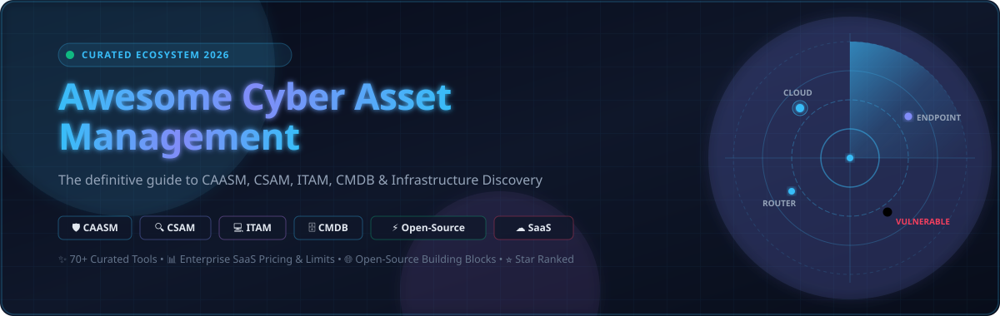

# 🛡️ Awesome Cyber Asset Management

<p align="center">
  
</p>

<p align="center">
  <a href="https://github.com/ishandutta2007/Awesome-Awesome-Awesome"></a>
  <a href="https://discord.gg/jc4xtF58Ve"></a>
  <a href="https://github.com/ishandutta2007/Awesome-Cyber-Asset-Management/stargazers"></a>
  <a href="https://github.com/ishandutta2007/Awesome-Cyber-Asset-Management/network/members"></a>
  <a href="https://github.com/ishandutta2007/Awesome-Cyber-Asset-Management/issues"></a>
  <a href="http://makeapullrequest.com"></a>
  <a href="https://opensource.org/licenses/MIT"></a>
  <a href="https://github.com/ishandutta2007"></a>
</p>

---

## 🎯 Top Cyber Asset Management Tools Ecosystem

**Curated List of SaaS/Hosted Enterprise Platforms & Open-Source GitHub Projects**  
*Focused on Cyber Asset Attack Surface Management (CAASM), Cybersecurity Asset Management (CSAM), IT Asset Discovery, Asset Inventory, CMDB, Attack Surface Management (EASM), and Infrastructure Asset Intelligence.*  
**Last updated: August 2026**

---

### 🌐 SEO Keywords & Domain Scope
> `Cyber Asset Management` • `CAASM` • `CSAM` • `ITAM` • `CMDB` • `External Attack Surface Management (EASM)` • `Cloud Asset Inventory` • `SBOM (Software Bill of Materials)` • `Vulnerability Management` • `Network Topology Discovery` • `Endpoint Telemetry` • `Exposure Management` • `Infrastructure Graph`

This repository tracks the premier **SaaS/hosted enterprise platforms** and **open-source projects** for **Cyber Asset Management**. These solutions discover, inventory, classify, enrich, correlate, monitor, and secure an organization's hardware, software, endpoints, cloud workloads, network infrastructure, identities, containers, applications, and technology assets.

Cyber Asset Management sits at the critical intersection of **CAASM, CSAM, IT Asset Management (ITAM), Configuration Management Databases (CMDB), IT & Network Discovery, Endpoint Detection & Response (EDR), Exposure Management, Cloud Security Posture Management (CSPM), Software Asset Management (SAM), and Security Operations (SecOps)**.

---

## 📑 Table of Contents

- [☁️ SaaS/Hosted Enterprise Platforms](#️-saashosted-enterprise-platforms)
- [⚡ Open-Source GitHub Projects (Star-Ranked)](#-open-source-github-projects-star-ranked)
- [🧩 Categorized Open-Source Building Blocks](#-categorized-open-source-building-blocks)
  - [🏢 IT Asset Management & CMDB](#-it-asset-management--cmdb)
  - [🖥️ Endpoint Discovery & Telemetry](#️-endpoint-discovery--telemetry)
  - [📡 Network & Attack Surface Discovery](#-network--attack-surface-discovery)
  - [☁️ Cloud & Container Asset Inventory](#️-cloud--container-asset-inventory)
  - [🛡️ Vulnerability, SBOM & Security Intelligence](#️-vulnerability-sbom--security-intelligence)
  - [🕸️ Infrastructure Graph & Relationship Mapping](#️-infrastructure-graph--relationship-mapping)
  - [📊 Observability & Infrastructure Monitoring](#-observability--infrastructure-monitoring)
  - [🔄 Data Pipelines & Asset Ingestion Engines](#-data-pipelines--asset-ingestion-engines)
  - [🗄️ Structured Databases & Search Stores](#️-structured-databases--search-stores)
- [🏗️ Architectural Blueprint: Self-Hosted CAM Stack](#️-architectural-blueprint-self-hosted-cam-stack)
- [💡 Important Cyber Asset Management Concepts](#-important-cyber-asset-management-concepts)
- [⭐ Star History](#-star-history)
- [🤝 How to Contribute](#-how-to-contribute)
- [📄 License & Disclaimer](#-license--disclaimer)

---

## ☁️ SaaS/Hosted Enterprise Platforms

*Sorted in descending order by company valuation, market capitalization, or annualized revenue.*

| Platform | Company Scale / Valuation / Revenue | Primary Focus / Description | Pricing (Starting Tiers) | Free Tier / Free Trial Limits |
| :--- | :--- | :--- | :--- | :--- |
| **[Microsoft Defender for Endpoint](https://www.microsoft.com/en-us/security/business/endpoint-security/microsoft-defender-endpoint)** | **~$3.1 Trillion** (Market Cap) / ~$245B+ Rev | Enterprise endpoint security and asset management providing continuous device discovery, inventory, telemetry, and vulnerability posture. | Plan 1: **$3.00/user/month** ($36.00/user/year); Plan 2: **$5.20/user/month** ($62.40/user/year, covers up to 5 devices per user) | **30-day free trial** (or up to 90-day evaluation for up to 25 user licenses via Microsoft 365 admin center; no permanent free tier) |
| **[Microsoft Defender EASM](https://www.microsoft.com/en-us/security/business/solutions/external-attack-surface-management)** | **~$3.1 Trillion** (Market Cap) / ~$245B+ Rev | External attack-surface discovery capability for continuously mapping internet-facing infrastructure, shadow IT, and exposed assets. | **$0.011 per approved asset/day** (~$0.33/asset/month or ~$4.015/asset/year based on approved inventory) | **30-day free trial** (full feature access for the first Defender EASM resource created; no permanent free tier) |
| **[ServiceNow Discovery](https://www.servicenow.com/products/it-operations-management/what-is-discovery.html)** | **~$195 Billion** (Market Cap) / ~$10B+ Rev | Enterprise ITOM infrastructure discovery capability that populates the ServiceNow CMDB with configuration items and relationship dependencies. | Starts at **~$42 – $60/node/year** (ITOM Visibility packages require annual commitments typically starting at ~$30,000 – $50,000/year) | **30-day sales-led POC trial** scoped to test environments, or Personal Developer Instance (PDI) with non-prod simulation; no permanent free tier |
| **[CrowdStrike Falcon](https://www.crowdstrike.com/)** | **~$90 Billion** (Market Cap) / ~$3.9B Rev | Cloud-native endpoint and cybersecurity platform delivering endpoint telemetry, asset discovery, vulnerability intelligence, and hygiene. | Falcon Go: **$59.99/device/year** ($299.95/yr minimum for 5 devices, max 100 devices); Falcon Pro: **$99.99/device/year** | **15-day free trial** (full access to Falcon Prevent NGAV and device control; no permanent free tier) |
| **[Fortinet Lacework](https://www.fortinet.com/products/cloud-security/lacework)** | **~$75 Billion** (Market Cap) / ~$5.8B Rev | Cloud security and CNAPP platform focused on automated multi-cloud asset discovery, workload inventory, and posture monitoring. | Starts at **~$12,000 – $24,000/year** (workload/host-based subscription starting at ~$30–$50/host/year) | **14-day free trial** / Cloud Security Assessment (via AWS Marketplace or direct sales request; no permanent free tier) |
| **[Datadog Infrastructure](https://www.datadoghq.com/product/infrastructure-monitoring/)** | **~$40 Billion** (Market Cap) / ~$2.6B Rev | Cloud observability and asset tracking platform that automatically discovers hosts, containers, services, and cloud resources. | Free for ≤5 hosts; Pro: **$15.00/host/month** (billed annually, or $18 on-demand); Enterprise: **$23.00/host/month** | **Free forever for up to 5 hosts** (1-day metric retention); 14-day free trial of full platform with unlimited hosts |
| **[Dynatrace](https://www.dynatrace.com/)** | **~$16 Billion** (Market Cap) / ~$1.5B Rev | Unified observability and topology mapping platform providing automated discovery across applications, infrastructure, and cloud environments. | Foundation & Discovery: **$0.01/host-hour** (~$7.00/host/month); Infrastructure: **$0.04/host-hour** (~$29.00/host/month); Full-Stack: **$0.01/GiB-hour** (~$58.00/host/mo) | **15-day free trial** (full platform access with no credit card required); permanent public interactive Playground environment |
| **[Wiz](https://www.wiz.io/)** | **~$12 Billion** (Valuation) / ~$500M+ ARR | Agentless cloud security platform providing cloud asset discovery, security graphing, identity relationships, and attack path analysis. | Starts at **~$24,000 – $38,000/year** for up to 100 workloads (annual subscription based on connected cloud instances/workloads) | **14-day to 30-day POC free trial** (scoped to connected AWS/Azure/GCP environments; no permanent free tier) |
| **[Tanium](https://www.tanium.com/)** | **~$9 Billion** (Valuation) / ~$600M+ ARR | Real-time endpoint management and security platform providing instant asset querying, complete inventory, and compliance enforcement. | Starts at **$20 – $24/endpoint/year** for core visibility (minimum entry contracts typically start at 1,000 endpoints = ~$20,000/year) | **30-day free trial / test drive** (via AWS Marketplace or direct sales for qualified environments; no permanent free tier) |
| **[SentinelOne Singularity](https://www.sentinelone.com/platform/)** | **~$8.5 Billion** (Market Cap) / ~$800M+ Rev | Autonomous security and asset visibility platform providing endpoint discovery, device inventory, telemetry, and automated remediation. | Singularity Core: **~$69.99/endpoint/year**; Singularity Control: **~$79.99/endpoint/year**; Singularity Complete: **~$159.99/endpoint/year** | **30-day POC free trial** (managed through partner/sales for qualified enterprise organizations; no permanent free tier) |
| **[BMC Helix Discovery](https://www.bmc.com/it-solutions/helix-discovery.html)** | **~$8.5 Billion** (PE Valuation) / ~$2B+ Rev | Automated IT infrastructure discovery and dependency-mapping platform discovering IT assets and relationships for CMDB and ITSM. | Starts at **~$40 – $75/node/year** (enterprise annual contracts typically starting at $25,000+ for minimum node blocks) | **30-day proof-of-concept (POC) trial** / live guided sandbox evaluation; no permanent free tier |
| **[ManageEngine AssetExplorer](https://www.manageengine.com/products/asset-explorer/)** | **~$5.0 Billion+** (Zoho Corp) / ~$1.3B Rev | Comprehensive IT asset-management and CMDB platform providing hardware/software inventory, license management, and automated discovery. | Free for ≤25 nodes (on-prem) or ≤50 nodes (cloud); Paid plans start at **$955/year** (on-prem) or **$1,245/year** (cloud) for 250 assets | **Free forever for up to 25 nodes** (on-prem) or 50 nodes (cloud); 30-day free trial for up to 250 assets |
| **[Tenable One / TVM](https://www.tenable.com/products/tenable-one)** | **~$5.2 Billion** (Market Cap) / ~$860M Rev | Exposure-management platform combining asset discovery, vulnerability management, attack-surface intelligence, and risk scoring. | Tenable Vulnerability Management starts at **$2,275/year** for 65 assets (~$35/asset/year); Tenable One starts at **~$50,000/year** for enterprise suites | **30-day free trial** for Tenable Vulnerability Management (up to 64 assets scanned); no permanent free tier |
| **[Qualys CSAM](https://www.qualys.com/apps/cybersecurity-asset-management/)** | **~$5.0 Billion** (Market Cap) / ~$600M Rev | Continuous Cybersecurity Asset Management providing comprehensive asset discovery, automated classification, and TruRisk prioritization. | Starts at **~$199 – $250/asset/year** standalone or **~$4.95/asset/year** add-on (entry package typically starts at ~$2,495/year for 500 assets) | **30-day free trial** (full access to CSAM & TruRisk with up to 256 assets scanned; no permanent free tier) |
| **[Freshservice](https://www.freshworks.com/freshservice/)** | **~$4.5 Billion** (Market Cap) / ~$700M Rev | Cloud IT service-management and asset discovery platform with hardware/software lifecycle management, CMDB, and contract tracking. | Starter: **$19/agent/month**; Growth: **$49/agent/month** (includes 100 assets; extra assets at $75–$125 per 500 asset units); Pro: **$95/agent/month** | **14-day free trial** (full Enterprise/Pro tier access with up to 100 requesters); no permanent free tier |
| **[Armis](https://www.armis.com/)** | **~$4.3 Billion** (Valuation) / ~$200M+ ARR | Cyber exposure management platform delivering complete asset visibility across managed, unmanaged, IoT, OT, IoMT, and cloud infrastructure. | Starts at **~$25,000/year** (annual contract based on connected device count, typically ~$30–$50/device/year) | **30-day proof-of-concept (POC) free trial** (custom-scoped device limit via private offer/sales; no permanent free tier) |
| **[Ivanti Neurons](https://www.ivanti.com/platform/ivanti-neurons)** | **~$4.0 Billion** (PE Valuation) / ~$1.0B+ Rev | Unified endpoint and asset-management platform providing automated device discovery, inventory, endpoint remediation, and compliance. | Starts at **~$25 – $50/device/year** (tiered modular subscriptions starting at ~$10,000/year base commitment) | **30-day sales-led POC trial**; no permanent free tier |
| **[Flexera One](https://www.flexera.com/products/flexera-one)** | **~$2.85 Billion** (PE Valuation) / ~$400M+ ARR | Technology intelligence platform covering IT asset inventory, SAM, cloud infrastructure optimization, and hardware/software lifecycle. | Starts at **~$25,000 – $50,000/year** (enterprise tier based on managed IT spend, asset count, and cloud workloads) | **30-day proof-of-concept (POC) trial** (or module-specific 14-day evaluation); no permanent free tier |
| **[Axonius](https://www.axonius.com/)** | **~$2.6 Billion** (Valuation) / ~$150M+ ARR | Pioneer CAASM platform that integrates with 1,000+ security and IT solutions to create a unified asset inventory and enforce security policies. | Starts at **~$20,000 – $40,000/year** (annual contract based on asset count, typically ~$20–$35/asset/year for entry deployments) | **14-day to 30-day proof-of-concept (POC) free trial** (custom-scoped asset limit via sales; no permanent free tier) |
| **[Rapid7 InsightVM](https://www.rapid7.com/)** | **~$2.5 Billion** (Market Cap) / ~$820M Rev | Vulnerability risk management and asset discovery platform providing live endpoint, cloud, and network exposure analytics. | Starts at **$1.62 – $1.93/asset/month** ($19.44 – $23.16/asset/year, minimum 500 assets = ~$9,720 – $11,500/year) | **30-day free trial** (full feature access for up to 256 live scanned assets; no permanent free tier) |
| **[Sysdig Secure](https://sysdig.com/)** | **~$2.5 Billion** (Valuation) / ~$100M+ ARR | Cloud and container security platform delivering real-time discovery and vulnerability visibility across hosts, containers, and Kubernetes. | Starts at **$17.50 – $40.00/host/month** (billed annually at ~$210 – $480/host/year, or $0.70/compute instance) | **30-day free trial** (full feature access for cloud & Kubernetes environments; no permanent free tier) |
| **[SolarWinds Service Desk](https://www.solarwinds.com/service-desk)** | **~$2.1 Billion** (Market Cap) / ~$780M Rev | IT service-management and asset-management platform with continuous discovery, CMDB configuration items, and risk audit logging. | Essentials: **$39/tech/month** ($468/tech/year); Advanced: **$79/tech/month** ($948/tech/year); Premier: **$99/tech/month** ($1,188/tech/year) | **30-day free trial** (full access to Premier tier features including asset discovery and CMDB; no permanent free tier) |
| **[NinjaOne](https://www.ninjaone.com/)** | **~$1.9 Billion** (Valuation) / ~$200M+ ARR | Automated endpoint management platform providing device discovery, hardware/software inventory, patch management, and remote operations. | Starts at **$3.75 – $6.00/device/month** ($45.00 – $72.00/device/year, scaling down to $1.50/device/month at volume) | **14-day free trial** (full platform access with unlimited test devices; no permanent free tier) |
| **[Forescout](https://www.forescout.com/)** | **~$1.9 Billion** (PE Valuation) / ~$300M+ ARR | Network-level device discovery, classification, asset intelligence, and security policy enforcement across IT, IoT, OT, and IoMT. | Starts at **~$30 – $60/device/year** (annual subscription based on monitored device count; entry deployments typically start at ~$25,000/year) | **30-day proof-of-concept (POC) free trial** (scoped to network environment; no permanent free tier) |
| **[Orca Security](https://orca.security/)** | **~$1.8 Billion** (Valuation) / ~$100M+ ARR | Agentless cloud security platform providing 100% asset discovery, cloud inventory, vulnerability management, and attack paths. | Starts at **~$15,000 – $25,000/year** (workload-based subscription starting at ~$50/workload/year on AWS Marketplace) | **30-day free trial** (accessible directly or via AWS Marketplace; no permanent free tier) |
| **[Lansweeper](https://www.lansweeper.com/)** | **~$300 Million** (Valuation) / ~$60M+ ARR | Automated technology asset discovery platform scanning hardware, software, users, and cloud resources across IT and OT networks. | Free for ≤100 assets; Starter tier starts at **€200/month** (~$216/month, €2,400/year) for up to 2,000 assets; Pro at **€350/month** | **Free forever for up to 100 assets** (Free Mode with community support); 14-day free trial with unlimited assets |
| **[runZero](https://www.runzero.com/)** | **~$250 Million** (Valuation) / ~$60M+ Raised | High-speed cyber asset management and network discovery platform identifying devices and exposed services without agents. | Free for ≤100 assets; Paid platform starts at **~$5,000/year** (sold in 500-asset increments at ~$2.50–$3.50/asset/year) | **Free forever for up to 100 assets** (Community Edition); 21-day free trial of full platform with unlimited assets |
| **[Device42](https://www.device42.com/)** | **~$230 Million** (Acquired) / Freshworks | Comprehensive IT infrastructure discovery and dependency mapping platform with CMDB, ADDM, DCIM, and IP address management. | Starts at **$4.50 – $6.50/device/year** (minimum entry annual contract typically starting at $1,500 – $2,500/year) | **14-day free trial** (up to 100 discovered devices); no permanent free tier |
| **[InvGate Asset Management](https://www.invgate.com/asset-management/)** | **~$70 Million** (Valuation) / ~$35M Raised | Intuitive IT asset-management platform covering hardware/software inventory, lifecycle tracking, and ITAM workflows. | Starter: **$0.21/node/month** ($1,250/year for 500 nodes); Pro: **$0.38/node/month** ($2,280/year for 500 nodes) | **30-day free trial** (fully functional with unlimited nodes during trial period; no permanent free tier) |
| **[Noetic Cyber](https://noeticcyber.com/)** | **~$50 Million** (Valuation) / ~$20M Raised | CAASM and cyber hygiene platform that correlates security telemetry, maps asset relationships, and automates control gap remediation. | Starts at **~$25,000 – $35,000/year** (annual subscription based on managed asset and connector volume) | **30-day guided proof-of-concept (POC) free trial** (scoped to organizational environment; no permanent free tier) |

---

## ⚡ Open-Source GitHub Projects (Star-Ranked)

*Sorted in descending order by GitHub stargazer count. Badges link directly to each repository's stargazers page.*

1. **[n8n](https://github.com/n8n-io/n8n)** [](https://github.com/n8n-io/n8n/stargazers)  
   Fair-code workflow automation platform with 400+ native integrations, ideal for chaining cyber asset discovery sources, triggering alerts, and automating remediation workflows.

2. **[Netdata](https://github.com/netdata/netdata)** [](https://github.com/netdata/netdata/stargazers)  
   High-performance, real-time infrastructure monitoring agent providing instant visibility and asset telemetry across physical and virtual systems.

3. **[Elasticsearch](https://github.com/elastic/elasticsearch)** [](https://github.com/elastic/elasticsearch/stargazers)  
   Distributed, JSON-based search and analytics engine widely used as the central indexing and query layer for massive cyber asset inventories.

4. **[Grafana](https://github.com/grafana/grafana)** [](https://github.com/grafana/grafana/stargazers)  
   Open-source visualization and analytics platform used for constructing interactive cyber asset inventory dashboards, attack-surface metrics, and posture reports.

5. **[Redis](https://github.com/redis/redis)** [](https://github.com/redis/redis/stargazers)  
   In-memory data structure store used as a lightning-fast caching and indexing layer for active asset discovery state and entity resolution.

6. **[Prometheus](https://github.com/prometheus/prometheus)** [](https://github.com/prometheus/prometheus/stargazers)  
   Cloud Native Computing Foundation monitoring system with automated service discovery and time-series metrics collection across distributed infrastructure.

7. **[ClickHouse](https://github.com/ClickHouse/ClickHouse)** [](https://github.com/ClickHouse/ClickHouse/stargazers)  
   Fast open-source column-oriented database management system for real-time analytical reporting on massive-scale network telemetry and endpoint asset logs.

8. **[Apache Airflow](https://github.com/apache/airflow)** [](https://github.com/apache/airflow/stargazers)  
   Programmatic workflow orchestration platform for scheduling, automating, and monitoring scheduled multi-source asset discovery and data normalization DAGs.

9. **[DuckDB](https://github.com/duckdb/duckdb)** [](https://github.com/duckdb/duckdb/stargazers)  
   In-process SQL OLAP database management system for fast local analytical processing, deduplication, and SQL querying of large cyber asset exports.

10. **[Metasploit Framework](https://github.com/rapid7/metasploit-framework)** [](https://github.com/rapid7/metasploit-framework/stargazers)  
    World's most used penetration testing framework, including extensive auxiliary modules for active network asset discovery, service enumeration, and banner grabbing.

11. **[Trivy](https://github.com/aquasecurity/trivy)** [](https://github.com/aquasecurity/trivy/stargazers)  
    Comprehensive and versatile security scanner for container images, file systems, Git repositories, virtual machines, Kubernetes, and AWS cloud assets.

12. **[Apache Kafka](https://github.com/apache/kafka)** [](https://github.com/apache/kafka/stargazers)  
    Distributed event streaming platform capable of handling trillions of real-time asset state change events, network probe logs, and endpoint telemetry records.

13. **[Nuclei](https://github.com/projectdiscovery/nuclei)** [](https://github.com/projectdiscovery/nuclei/stargazers)  
    Fast, template-based vulnerability and attack-surface scanner for discovering and fingerprinting exposed services, software versions, and security misconfigurations.

14. **[Masscan](https://github.com/robertdavidgraham/masscan)** [](https://github.com/robertdavidgraham/masscan/stargazers)  
    TCP port scanner capable of scanning the entire Internet in under 5 minutes, essential for internet-scale asset discovery and perimeter mapping.

15. **[osquery](https://github.com/osquery/osquery)** [](https://github.com/osquery/osquery/stargazers)  
    SQL powered operating system instrumentation framework that exposes low-level hardware, software, process, network, and configuration state as relational database tables.

16. **[Vector](https://github.com/vectordotdev/vector)** [](https://github.com/vectordotdev/vector/stargazers)  
    High-performance observability data pipeline for collecting, transforming, and routing asset discovery logs, network telemetry, and endpoint events.

17. **[Airbyte](https://github.com/airbytehq/airbyte)** [](https://github.com/airbytehq/airbyte/stargazers)  
    Leading open-source ELT data integration platform with hundreds of connectors to pull asset and configuration data from SaaS, cloud, and security APIs.

18. **[PostgreSQL](https://github.com/postgres/postgres)** [](https://github.com/postgres/postgres/stargazers)  
    Powerful, open-source object-relational database system serving as the core persistence and relational modeling engine for CMDB and ITAM architectures.

19. **[NetBox](https://github.com/netbox-community/netbox)** [](https://github.com/netbox-community/netbox/stargazers)  
    Premier open-source network source-of-truth and infrastructure modeling platform covering IPAM, DCIM, devices, racks, VLANs, VRFs, and network connections.

20. **[SpiderFoot](https://github.com/smicallef/spiderfoot)** [](https://github.com/smicallef/spiderfoot/stargazers)  
    Open-source automated OSINT and external attack-surface discovery tool that queries 100+ public data sources to map domains, IP space, certificates, and infrastructure.

21. **[NetworkX](https://github.com/networkx/networkx)** [](https://github.com/networkx/networkx/stargazers)  
    Python library for the creation, manipulation, and study of the structure, dynamics, and functions of complex cyber asset relationship graphs and attack paths.

22. **[Neo4j](https://github.com/neo4j/neo4j)** [](https://github.com/neo4j/neo4j/stargazers)  
    Industry-standard native graph database engineered for modeling and querying deeply connected cyber asset graphs (Asset → User → Software → Vulnerability).

23. **[Wazuh](https://github.com/wazuh/wazuh)** [?style=social&color=white](https://github.com/wazuh/wazuh/stargazers)  
    Unified open-source security monitoring platform providing endpoint inventory, software inventory, vulnerability detection, configuration compliance, and file integrity monitoring.

24. **[Amass (OWASP)](https://github.com/owasp-amass/amass)** [](https://github.com/owasp-amass/amass/stargazers)  
    In-depth network mapping and external attack-surface asset discovery tool that uses DNS enumeration, scraping, certificates, and graph database storage.

25. **[Logstash](https://github.com/elastic/logstash)** [](https://github.com/elastic/logstash/stargazers)  
    Server-side data processing pipeline that ingests data from a multitude of asset discovery sources simultaneously, transforms it, and sends it to Elasticsearch.

26. **[OpenMetadata](https://github.com/open-metadata/OpenMetadata)** [](https://github.com/open-metadata/OpenMetadata/stargazers)  
    Unified metadata management and governance platform providing automated discovery, lineage, and cataloging of enterprise data assets and APIs.

27. **[Snipe-IT](https://github.com/grokability/snipe-it)** [](https://github.com/grokability/snipe-it/stargazers)  
    Widely used open-source IT asset management platform built for tracking hardware assets, software licenses, accessories, consumables, and device ownership lifecycles.

28. **[Prowler](https://github.com/prowler-cloud/prowler)** [](https://github.com/prowler-cloud/prowler/stargazers)  
    Open-source multi-cloud security assessment and inventory tool for AWS, Azure, GCP, and Kubernetes covering 300+ CIS and security controls.

29. **[Subfinder](https://github.com/projectdiscovery/subfinder)** [](https://github.com/projectdiscovery/subfinder/stargazers)  
    Fast passive subdomain discovery tool designed for mapping organizational internet attack surfaces using curated passive intelligence sources.

30. **[OpenSearch](https://github.com/opensearch-project/OpenSearch)** [](https://github.com/opensearch-project/OpenSearch/stargazers)  
    Community-driven, open-source search and analytics suite offering scalable full-text and structured searching across massive cyber asset inventories.

31. **[Nmap](https://github.com/nmap/nmap)** [](https://github.com/nmap/nmap/stargazers)  
    The legendary network discovery and vulnerability scanning tool that discovers active hosts, open ports, OS versions, running services, and device fingerprints.

32. **[Grype](https://github.com/anchore/grype)** [](https://github.com/anchore/grype/stargazers)  
    Fast vulnerability scanner for container images and file systems, easily matched against Software Bill of Materials (SBOMs) to enrich asset risk profiles.

33. **[httpx](https://github.com/projectdiscovery/httpx)** [](https://github.com/projectdiscovery/httpx/stargazers)  
    Fast multi-purpose HTTP toolkit that allows running multiple probes for discovering, fingerprinting, and classifying web applications and services.

34. **[OpenCTI](https://github.com/OpenCTI-Platform/opencti)** [](https://github.com/OpenCTI-Platform/opencti/stargazers)  
    Open-source Cyber Threat Intelligence platform useful for structuring knowledge graphs connecting organizational assets to threats, IOCs, and CVEs.

35. **[Syft](https://github.com/anchore/syft)** [](https://github.com/anchore/syft/stargazers)  
    CLI tool and Go library for generating a Software Bill of Materials (SBOM) from container images and filesystems, enabling comprehensive software asset inventory.

36. **[Fluent Bit](https://github.com/fluent/fluent-bit)** [](https://github.com/fluent/fluent-bit/stargazers)  
    Super-fast, lightweight log and metrics collector and processor designed for capturing endpoint and cloud asset discovery telemetry at high scale.

37. **[Steampipe](https://github.com/turbot/steampipe)** [](https://github.com/turbot/steampipe/stargazers)  
    Zero-ETL engine that lets you query cloud APIs, code repositories, containers, and network infrastructure directly as relational SQL tables.

38. **[ScoutSuite](https://github.com/nccgroup/ScoutSuite)** [](https://github.com/nccgroup/ScoutSuite/stargazers)  
    Multi-cloud security auditing tool that queries cloud API endpoints to collect and visualize configuration data across AWS, Azure, GCP, and Alibaba Cloud.

39. **[Headlamp](https://github.com/kubernetes-sigs/headlamp)** [](https://github.com/kubernetes-sigs/headlamp/stargazers)  
    Easy-to-use and extensible Kubernetes web UI providing instant visibility into clusters, namespaces, workloads, nodes, and containerized assets.

40. **[NetAlertX](https://github.com/netalertx/NetAlertX)** [](https://github.com/netalertx/NetAlertX/stargazers)  
    Self-hosted network monitor and discovery tool that scans local subnets, alerts on new devices, and maintains an active inventory of connected hardware.

41. **[Fleet](https://github.com/fleetdm/fleet)** [](https://github.com/fleetdm/fleet/stargazers)  
    Centralized open-source device management and osquery manager for query-driven real-time endpoint inventory and compliance across macOS, Linux, and Windows.

42. **[CloudQuery](https://github.com/cloudquery/cloudquery)** [](https://github.com/cloudquery/cloudquery/stargazers)  
    Open-source ELT framework for cloud infrastructure and SaaS assets that syncs configuration state into PostgreSQL, Snowflake, BigQuery, and SQLite.

43. **[MISP](https://github.com/MISP/MISP)** [](https://github.com/MISP/MISP/stargazers)  
    Open-source threat intelligence platform for sharing, storing, and correlating indicators of compromise (IoCs) with discovered cyber assets.

44. **[Zabbix](https://github.com/zabbix/zabbix)** [](https://github.com/zabbix/zabbix/stargazers)  
    Enterprise-class open-source monitoring platform capable of network discovery, host hardware/software inventory, and real-time infrastructure state tracking.

45. **[GLPI](https://github.com/glpi-project/glpi)** [](https://github.com/glpi-project/glpi/stargazers)  
    Full-featured open-source IT asset management (ITAM), service desk, and CMDB platform for tracking computers, network equipment, printers, and licenses.

46. **[Apache NiFi](https://github.com/apache/nifi)** [](https://github.com/apache/nifi/stargazers)  
    Visual dataflow management platform for automating the ingestion, transformation, enrichment, and movement of asset telemetry across systems.

47. **[Naabu](https://github.com/projectdiscovery/naabu)** [](https://github.com/projectdiscovery/naabu/stargazers)  
    Fast and reliable SYN/CONNECT port scanning tool written in Go, optimized for asset discovery pipelines and attack-surface management workflows.

48. **[kube-state-metrics](https://github.com/kubernetes/kube-state-metrics)** [](https://github.com/kubernetes/kube-state-metrics/stargazers)  
    Core Kubernetes telemetry agent that generates metrics listening to the Kubernetes API server to track the real-time state of all cluster resources and workloads.

49. **[Cloud Custodian](https://github.com/cloud-custodian/cloud-custodian)** [](https://github.com/cloud-custodian/cloud-custodian/stargazers)  
    Rules engine for cloud security, governance, and asset management that uses simple YAML policies to filter, tag, and remediate cloud resources.

50. **[JanusGraph](https://github.com/JanusGraph/janusgraph)** [](https://github.com/JanusGraph/janusgraph/stargazers)  
    Scalable open-source graph database optimized for storing and querying massive cyber asset graphs with billions of vertices and edges.

51. **[DefectDojo](https://github.com/DefectDojo/django-DefectDojo)** [](https://github.com/DefectDojo/django-DefectDojo/stargazers)  
    Leading open-source application vulnerability correlation and security orchestration tool that maps findings directly to products, endpoints, and assets.

52. **[LibreNMS](https://github.com/librenms/librenms)** [](https://github.com/librenms/librenms/stargazers)  
    Auto-discovering PHP/SNMP network monitoring system providing hardware inventory, network topology maps, and device telemetry.

53. **[OpenVAS Scanner](https://github.com/greenbone/openvas-scanner)** [](https://github.com/greenbone/openvas-scanner/stargazers)  
    Full-featured open-source vulnerability scanner component of Greenbone Community Edition for detecting vulnerabilities on discovered network hosts.

54. **[Apache AGE](https://github.com/apache/age)** [](https://github.com/apache/age/stargazers)  
    PostgreSQL extension that provides graph database capabilities, enabling openCypher graph queries on top of existing relational cyber asset stores.

55. **[Cartography](https://github.com/cartography-cncf/cartography)** [](https://github.com/cartography-cncf/cartography/stargazers)  
    CNCF asset graphing tool that consolidates infrastructure assets and dependencies into a Neo4j graph to expose attack paths and security relationships.

56. **[phpIPAM](https://github.com/phpipam/phpipam)** [](https://github.com/phpipam/phpipam/stargazers)  
    Robust open-source IP address management (IPAM) application for managing subnets, IP space, VLANs, VRFs, and hardware device bindings.

57. **[Ralph](https://github.com/allegro/ralph)** [](https://github.com/allegro/ralph/stargazers)  
    Open-source asset management, DCIM, and CMDB system designed for data centers and enterprise IT hardware tracking.

58. **[Kubevious](https://github.com/kubevious/kubevious)** [](https://github.com/kubevious/kubevious/stargazers)  
    Kubernetes configuration linter and visualization dashboard that models application dependencies and configuration relationships.

59. **[Nautobot](https://github.com/nautobot/nautobot)** [](https://github.com/nautobot/nautobot/stargazers)  
    Network Source of Truth and Network Automation Platform for modeling devices, IP addresses, circuits, and interconnectivity.

60. **[OpenNMS](https://github.com/OpenNMS/opennms)** [](https://github.com/OpenNMS/opennms/stargazers)  
    Enterprise-grade carrier-class network management application platform providing network discovery, topology visualization, and performance monitoring.

61. **[iTop](https://github.com/Combodo/iTop)** [](https://github.com/Combodo/iTop/stargazers)  
    Open-source web-based IT service management (ITSM) and CMDB platform for managing configuration items (CIs), dependencies, and user services.

62. **[Netdisco](https://github.com/netdisco/netdisco)** [](https://github.com/netdisco/netdisco/stargazers)  
    SNMP-based web network management tool that automatically discovers network topology, switch port allocations, MAC addresses, and IP space.

63. **[Rudder](https://github.com/Normation/rudder)** [](https://github.com/Normation/rudder/stargazers)  
    Continuous configuration and compliance platform providing continuous node inventory, system telemetry, and automated security configuration.

64. **[GLPI Agent](https://github.com/glpi-project/glpi-agent)** [](https://github.com/glpi-project/glpi-agent/stargazers)  
    Multi-platform cross-OS client agent for GLPI that gathers detailed hardware, software, network, and peripheral asset inventories.

65. **[OCS Inventory NG](https://github.com/OCSInventory-NG/OCSInventory-Server)** [](https://github.com/OCSInventory-NG/OCSInventory-Server/stargazers)  
    Open-source automated IT inventory and asset-discovery platform collecting comprehensive hardware and software data from distributed agents.

---

## 🧩 Categorized Open-Source Building Blocks

The open-source ecosystem provides powerful individual layers that can be combined to build a complete, resilient self-hosted Cyber Asset Management architecture.

### 🏢 IT Asset Management & CMDB
- **[GLPI](https://github.com/glpi-project/glpi)** [](https://github.com/glpi-project/glpi/stargazers) — Enterprise ITAM, CMDB, service desk, and license tracking.
- **[Snipe-IT](https://github.com/grokability/snipe-it)** [](https://github.com/grokability/snipe-it/stargazers) — Hardware, software license, and accessory lifecycle management.
- **[NetBox](https://github.com/netbox-community/netbox)** [](https://github.com/netbox-community/netbox/stargazers) — Network source-of-truth, IPAM, and data center DCIM.
- **[Ralph](https://github.com/allegro/ralph)** [](https://github.com/allegro/ralph/stargazers) — Data-center asset management, DCIM, and CMDB.
- **[Nautobot](https://github.com/nautobot/nautobot)** [](https://github.com/nautobot/nautobot/stargazers) — Network source-of-truth and automation engine.
- **[iTop](https://github.com/Combodo/iTop)** [](https://github.com/Combodo/iTop/stargazers) — ITIL-compliant ITSM, CMDB, and CI relationship management.
- **[phpIPAM](https://github.com/phpipam/phpipam)** [](https://github.com/phpipam/phpipam/stargazers) — Open-source IP address management and subnet tracking.
- **[OCS Inventory Server](https://github.com/OCSInventory-NG/OCSInventory-Server)** [](https://github.com/OCSInventory-NG/OCSInventory-Server/stargazers) — Centralized inventory server for endpoint agents.

### 🖥️ Endpoint Discovery & Telemetry
- **[osquery](https://github.com/osquery/osquery)** [](https://github.com/osquery/osquery/stargazers) — SQL-based endpoint inspection and telemetry instrumentation.
- **[Wazuh](https://github.com/wazuh/wazuh)** [](https://github.com/wazuh/wazuh/stargazers) — Endpoint inventory, vulnerability detection, and security monitoring.
- **[Fleet](https://github.com/fleetdm/fleet)** [](https://github.com/fleetdm/fleet/stargazers) — Centralized osquery fleet manager for live endpoint querying.
- **[Rudder](https://github.com/Normation/rudder)** [](https://github.com/Normation/rudder/stargazers) — Endpoint configuration, compliance management, and continuous inventory.
- **[GLPI Agent](https://github.com/glpi-project/glpi-agent)** [](https://github.com/glpi-project/glpi-agent/stargazers) — Cross-platform endpoint inventory collector.

### 📡 Network & Attack Surface Discovery
- **[Nmap](https://github.com/nmap/nmap)** [](https://github.com/nmap/nmap/stargazers) — Host discovery, port scanning, OS fingerprinting, and service detection.
- **[Masscan](https://github.com/robertdavidgraham/masscan)** [](https://github.com/robertdavidgraham/masscan/stargazers) — High-speed asynchronous Internet-scale port scanner.
- **[OWASP Amass](https://github.com/owasp-amass/amass)** [](https://github.com/owasp-amass/amass/stargazers) — External attack surface discovery and active/passive DNS mapping.
- **[SpiderFoot](https://github.com/smicallef/spiderfoot)** [](https://github.com/smicallef/spiderfoot/stargazers) — Automated OSINT collection for external digital footprints.
- **[Subfinder](https://github.com/projectdiscovery/subfinder)** [](https://github.com/projectdiscovery/subfinder/stargazers) — Passive subdomain enumeration for internet assets.
- **[httpx](https://github.com/projectdiscovery/httpx)** [](https://github.com/projectdiscovery/httpx/stargazers) — Fast HTTP probing and technology fingerprinting.
- **[Naabu](https://github.com/projectdiscovery/naabu)** [](https://github.com/projectdiscovery/naabu/stargazers) — Fast port discovery utility for attack surface scanning.
- **[NetAlertX](https://github.com/netalertx/NetAlertX)** [](https://github.com/netalertx/NetAlertX/stargazers) — LAN device discovery and rogue device notification.
- **[Netdisco](https://github.com/netdisco/netdisco)** [](https://github.com/netdisco/netdisco/stargazers) — Layer 2/3 network topology mapping via SNMP.

### ☁️ Cloud & Container Asset Inventory
- **[CloudQuery](https://github.com/cloudquery/cloudquery)** [](https://github.com/cloudquery/cloudquery/stargazers) — Open-source ELT framework for cloud asset inventory.
- **[Steampipe](https://github.com/turbot/steampipe)** [](https://github.com/turbot/steampipe/stargazers) — Query live cloud APIs directly using SQL.
- **[Prowler](https://github.com/prowler-cloud/prowler)** [](https://github.com/prowler-cloud/prowler/stargazers) — Cloud security assessment and resource inventory for AWS/Azure/GCP.
- **[ScoutSuite](https://github.com/nccgroup/ScoutSuite)** [](https://github.com/nccgroup/ScoutSuite/stargazers) — Multi-cloud posture auditing and asset collection.
- **[Cloud Custodian](https://github.com/cloud-custodian/cloud-custodian)** [](https://github.com/cloud-custodian/cloud-custodian/stargazers) — YAML policy engine for cloud resource classification and governance.
- **[Headlamp](https://github.com/kubernetes-sigs/headlamp)** [](https://github.com/kubernetes-sigs/headlamp/stargazers) — Extensible Kubernetes dashboard for cluster resource visibility.
- **[kube-state-metrics](https://github.com/kubernetes/kube-state-metrics)** [](https://github.com/kubernetes/kube-state-metrics/stargazers) — Cluster-level Kubernetes asset state exporter.
- **[Kubevious](https://github.com/kubevious/kubevious)** [](https://github.com/kubevious/kubevious/stargazers) — Kubernetes resource and dependency visualization.

### 🛡️ Vulnerability, SBOM & Security Intelligence
- **[Trivy](https://github.com/aquasecurity/trivy)** [](https://github.com/aquasecurity/trivy/stargazers) — Comprehensive vulnerability and cloud resource scanner.
- **[Nuclei](https://github.com/projectdiscovery/nuclei)** [](https://github.com/projectdiscovery/nuclei/stargazers) — Fast template-driven vulnerability scanner for assets.
- **[DefectDojo](https://github.com/DefectDojo/django-DefectDojo)** [](https://github.com/DefectDojo/django-DefectDojo/stargazers) — Vulnerability management and asset risk correlation platform.
- **[Grype](https://github.com/anchore/grype)** [](https://github.com/anchore/grype/stargazers) — Fast vulnerability scanner for SBOMs and container images.
- **[Syft](https://github.com/anchore/syft)** [](https://github.com/anchore/syft/stargazers) — Software Bill of Materials (SBOM) generator for software inventory.
- **[OpenVAS Scanner](https://github.com/greenbone/openvas-scanner)** [](https://github.com/greenbone/openvas-scanner/stargazers) — Comprehensive network vulnerability scanner.
- **[OpenCTI](https://github.com/OpenCTI-Platform/opencti)** [](https://github.com/OpenCTI-Platform/opencti/stargazers) — Cyber threat intelligence knowledge graph.
- **[MISP](https://github.com/MISP/MISP)** [](https://github.com/MISP/MISP/stargazers) — Threat intelligence platform for enriching asset context.

### 🕸️ Infrastructure Graph & Relationship Mapping
- **[Cartography](https://github.com/cartography-cncf/cartography)** [](https://github.com/cartography-cncf/cartography/stargazers) — Automated asset consolidation into Neo4j infrastructure graphs.
- **[Neo4j](https://github.com/neo4j/neo4j)** [](https://github.com/neo4j/neo4j/stargazers) — Graph database optimized for multi-hop asset relationship queries.
- **[NetworkX](https://github.com/networkx/networkx)** [](https://github.com/networkx/networkx/stargazers) — Python graph library for topology analysis and path calculation.
- **[Apache AGE](https://github.com/apache/age)** [](https://github.com/apache/age/stargazers) — Graph database extension for PostgreSQL.
- **[JanusGraph](https://github.com/JanusGraph/janusgraph)** [](https://github.com/JanusGraph/janusgraph/stargazers) — Distributed graph database for massive scale asset graphs.

### 📊 Observability & Infrastructure Monitoring
- **[Netdata](https://github.com/netdata/netdata)** [](https://github.com/netdata/netdata/stargazers) — Real-time infrastructure telemetry and host discovery.
- **[Grafana](https://github.com/grafana/grafana)** [](https://github.com/grafana/grafana/stargazers) — Interactive dashboards and reporting for asset metrics.
- **[Prometheus](https://github.com/prometheus/prometheus)** [](https://github.com/prometheus/prometheus/stargazers) — Time-series monitoring with automated service discovery.
- **[Zabbix](https://github.com/zabbix/zabbix)** [](https://github.com/zabbix/zabbix/stargazers) — Network discovery and infrastructure monitoring.
- **[LibreNMS](https://github.com/librenms/librenms)** [](https://github.com/librenms/librenms/stargazers) — Auto-discovering SNMP network monitor.
- **[OpenNMS](https://github.com/OpenNMS/opennms)** [](https://github.com/OpenNMS/opennms/stargazers) — Enterprise network discovery and topology monitoring.

### 🔄 Data Pipelines & Asset Ingestion Engines
- **[n8n](https://github.com/n8n-io/n8n)** [](https://github.com/n8n-io/n8n/stargazers) — Workflow automation for connector orchestration and alert triggers.
- **[Airbyte](https://github.com/airbytehq/airbyte)** [](https://github.com/airbytehq/airbyte/stargazers) — Universal ELT data sync for SaaS, cloud, and asset APIs.
- **[Apache Airflow](https://github.com/apache/airflow)** [](https://github.com/apache/airflow/stargazers) — Programmatic orchestration of asset extraction pipelines.
- **[Apache Kafka](https://github.com/apache/kafka)** [](https://github.com/apache/kafka/stargazers) — Event streaming engine for real-time asset telemetry.
- **[Vector](https://github.com/vectordotdev/vector)** [](https://github.com/vectordotdev/vector/stargazers) — High-throughput observability data router.
- **[Fluent Bit](https://github.com/fluent/fluent-bit)** [](https://github.com/fluent/fluent-bit/stargazers) — Lightweight log and telemetry collector.
- **[Logstash](https://github.com/elastic/logstash)** [](https://github.com/elastic/logstash/stargazers) — Multi-source log transformation pipeline.
- **[Apache NiFi](https://github.com/apache/nifi)** [](https://github.com/apache/nifi/stargazers) — Visual enterprise dataflow and asset ingestion.

### 🗄️ Structured Databases & Search Stores
- **[Elasticsearch](https://github.com/elastic/elasticsearch)** [](https://github.com/elastic/elasticsearch/stargazers) — Distributed search engine for fast asset querying.
- **[Redis](https://github.com/redis/redis)** [](https://github.com/redis/redis/stargazers) — Ultra-fast caching for active asset states and deduplication.
- **[ClickHouse](https://github.com/ClickHouse/ClickHouse)** [](https://github.com/ClickHouse/ClickHouse/stargazers) — Real-time columnar analytics for massive asset datasets.
- **[PostgreSQL](https://github.com/postgres/postgres)** [](https://github.com/postgres/postgres/stargazers) — Robust relational storage for CMDB and asset state.
- **[DuckDB](https://github.com/duckdb/duckdb)** [](https://github.com/duckdb/duckdb/stargazers) — In-process SQL database for quick local analysis.
- **[OpenSearch](https://github.com/opensearch-project/OpenSearch)** [](https://github.com/opensearch-project/OpenSearch/stargazers) — Open-source search suite for asset inventory management.
- **[OpenMetadata](https://github.com/open-metadata/OpenMetadata)** [](https://github.com/open-metadata/OpenMetadata/stargazers) — Centralized metadata catalog and governance.

---

## 🏗️ Architectural Blueprint: Self-Hosted CAM Stack

A robust, enterprise-grade open-source Cyber Asset Management system combines the following modular layers:

```text
                         ┌─────────────────────────────────┐
                         │      📡 Multi-Domain Sources    │
                         │                                 │
                         │ Endpoints / Servers / Networks  │
                         │ Cloud / SaaS / Containers / OT  │
                         │ IoT / Web Apps / Identities     │
                         └───────────────┬─────────────────┘
                                         │
              ┌──────────────────────────┼──────────────────────────┐
              │                          │                          │
              ▼                          ▼                          ▼
     ┌──────────────────┐      ┌──────────────────┐      ┌──────────────────┐
     │ 📡 Network Scans │      │ 🖥️ Endpoint State│      │ ☁️ Cloud & SBOM   │
     │                  │      │                  │      │                  │
     │ Nmap / Masscan   │      │ osquery / Fleet  │      │ CloudQuery       │
     │ Amass / Naabu    │      │ Wazuh / Rudder   │      │ Steampipe / Syft │
     │ SpiderFoot       │      │ GLPI Agent       │      │ Trivy / Prowler  │
     └─────────┬────────┘      └─────────┬────────┘      └─────────┬────────┘
               │                         │                         │
               └─────────────────────────┼─────────────────────────┘
                                         │
                                         ▼
                         ┌─────────────────────────────────┐
                         │   ⚙️ Ingestion & Normalization  │
                         │                                 │
                         │ Vector / Airbyte / Kafka / NiFi │
                         │ Deduplication / Fingerprinting │
                         │ Hostname / IP / MAC / UUID      │
                         │ Software & Hardware Normalization│
                         └───────────────┬─────────────────┘
                                         │
                                         ▼
                         ┌─────────────────────────────────┐
                         │      🔗 Entity Resolution       │
                         │                                 │
                         │ Reconciling Identities Across:  │
                         │ Network ↔ Agent ↔ Cloud ↔ SaaS  │
                         └───────────────┬─────────────────┘
                                         │
                                         ▼
                         ┌─────────────────────────────────┐
                         │     🛡️ Security Intelligence    │
                         │                                 │
                         │ CVE Correlation (Trivy/DefectDojo)│
                         │ Threat Intel (OpenCTI / MISP)   │
                         │ Asset Criticality & Owner Tags  │
                         └───────────────┬─────────────────┘
                                         │
                    ┌────────────────────┼────────────────────┐
                    │                    │                    │
                    ▼                    ▼                    ▼
          ┌─────────────────┐  ┌─────────────────┐  ┌─────────────────┐
          │ 🏢 CMDB / ITAM  │  │ 🗄️ Search Store │  │ 🕸️ Asset Graph  │
          │                 │  │                 │  │                 │
          │ NetBox / GLPI   │  │ Elasticsearch   │  │ Neo4j           │
          │ Snipe-IT / iTop │  │ PostgreSQL      │  │ Cartography     │
          │ Ralph           │  │ ClickHouse      │  │ Apache AGE      │
          └────────┬────────┘  └────────┬────────┘  └────────┬────────┘
                   │                    │                    │
                   └────────────────────┼────────────────────┘
                                        │
                                        ▼
                         ┌─────────────────────────────────┐
                         │     🔍 Unified Asset Graph      │
                         │                                 │
                         │ Asset → Owner → Software        │
                         │ Asset → Network → Exposed Port  │
                         │ Asset → Vulnerability → Impact  │
                         │ Asset → Cloud Account → IAM     │
                         └───────────────┬─────────────────┘
                                         │
                                         ▼
                         ┌─────────────────────────────────┐
                         │    🚨 Automated Remediation     │
                         │                                 │
                         │ n8n / Airflow / Webhooks        │
                         │ Ticket Creation / ITAM Sync     │
                         │ Rogue Device Quarantine         │
                         └─────────────────────────────────┘
```

---

## 💡 Important Cyber Asset Management Concepts

- **CAASM (Cyber Asset Attack Surface Management):** An emerging security discipline focused on providing complete visibility into internal and external technology assets by ingesting data from API connectors rather than relying exclusively on active scanning.
- **CSAM (Cybersecurity Asset Management):** The ongoing process of discovering, monitoring, classifying, and maintaining asset security baselines, software patch statuses, and configuration compliance.
- **EASM (External Attack Surface Management):** Continuous discovery, analysis, and monitoring of all internet-facing digital assets, exposed ports, domain names, shadow IT, and public cloud resources.
- **ITAM vs. CMDB vs. CAASM:**
  - **ITAM:** Focuses on procurement, ownership, software licensing, cost, and lifecycle accounting.
  - **CMDB:** Focuses on service configuration items (CIs), application dependencies, and ITSM incident/change impact.
  - **CAASM:** Focuses on comprehensive security visibility, control verification, coverage gaps, and exposure risk.

---

## ⭐ Star History

[](https://star-history.dera.page/#ishandutta2007/Awesome-Cyber-Asset-Management&type=date&legend=top-left)

---

## 🤝 How to Contribute

Contributions are always welcome! 

1. 🍴 Fork the repository.
2. 🌿 Create your feature branch (`git checkout -b feature/new-tool`).
3. 📝 Add your entry with clear details, pricing/free tier specs, and official links.
4. 🚀 Commit your changes (`git commit -m 'Add awesome tool'`).
5. 📤 Push to the branch (`git push origin feature/new-tool`).
6. 📬 Open a Pull Request.

---

## 📄 License & Disclaimer

- Distributed under the **MIT License**. See `LICENSE` for more information.
- *Disclaimer:* Product names, logos, brands, and registered trademarks referenced in this repository are the property of their respective owners. Mention of commercial platforms is for educational and directory purposes only and does not constitute an endorsement.
